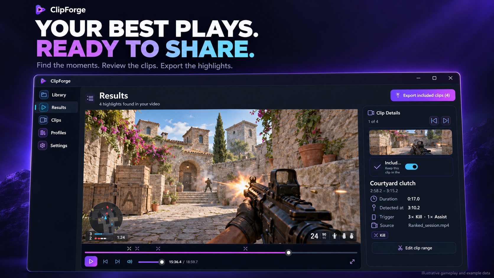
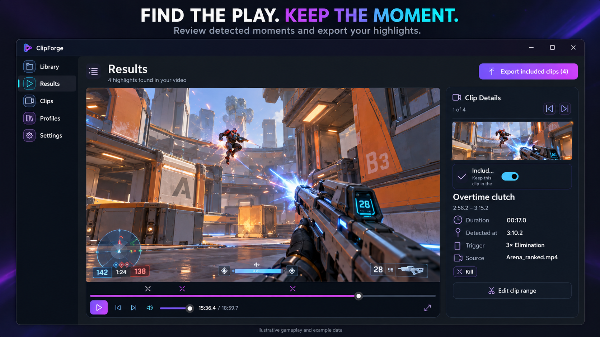
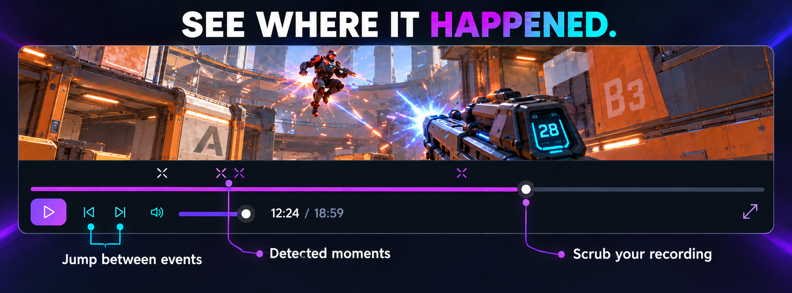
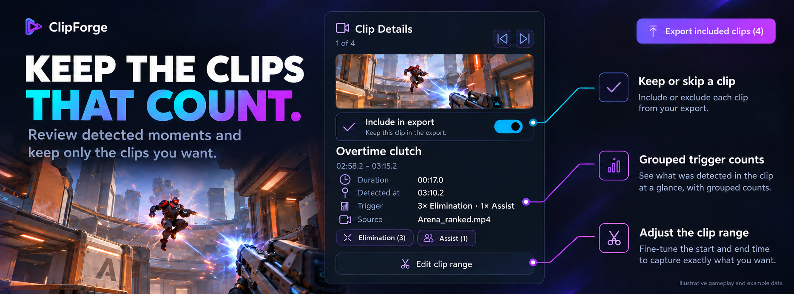
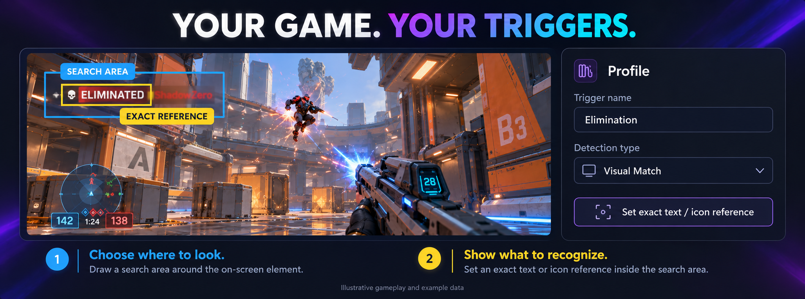
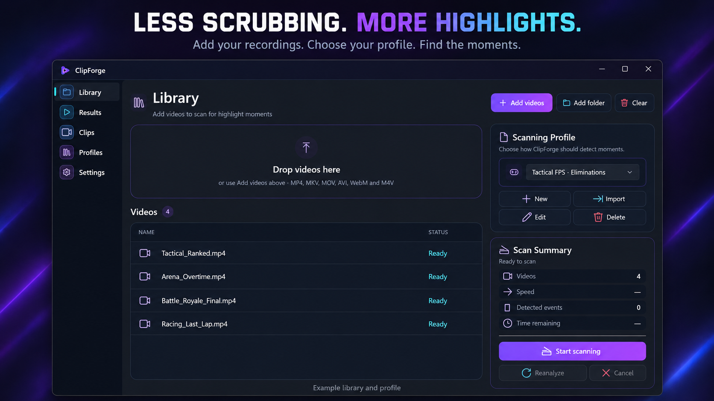

# ClipForge

### Turn hours of gameplay into the moments worth keeping.

**Find the action. Review the clips. Export your highlights.**

Stop scrubbing through every minute of a recording. ClipForge finds the HUD events you define and gives you a visual workspace to decide what stays.

  
  
  
  

[**🚀 Get started**](#get-started) · [**🎯 Create a game profile**](docs/CREATE_PROFILE.md) · [**⭐ Star ClipForge**](https://github.com/ForthtuN/ClipForge) · [**🐛 Report an issue**](https://github.com/ForthtuN/ClipForge/issues)

---

## Your best clips are already in your recordings.

A two-hour session might contain a clutch, a comeback, a clean headshot or the objective that won the round. ClipForge helps you find those moments without turning review into another grind.

- 🎯 **Your triggers** — define the icons, words and HUD events that matter to you.
- ⚡ **GPU scanning** — NVIDIA-accelerated scanning for supported recordings.
- 🎞️ **Visual review** — jump to detected moments, scrub the source and inspect each clip.
- ✂️ **Your final cut** — keep or skip clips, adjust their ranges and export your picks.
- 🔒 **Local footage** — recordings are processed on your PC, with no footage upload required.

---

## Review the play. Keep the moment.

Scanning gets you to the action. Results puts you in control: watch the preview, jump between moments and choose the clips worth sharing. Use fullscreen when you want a closer look.

### A timeline that shows you where things happened

**See the markers. Jump to the moment. Scrub around it.** Detected events sit directly above the playback slider, so you can navigate the recording without hunting through a list of timestamps.

### Know what each clip contains

A clip can contain several detected moments. Clip Details shows grouped counts using your trigger names — for example, **3× Elimination · 1× Assist** — together with the clip's duration and source.

Keep it in the export, skip it, or adjust its range. **You choose the highlights; ClipForge leaves the source recording untouched.**

---

## Your game. Your definition of a highlight.

**Show what to recognize. Choose where to look.** Pause on a HUD event, draw a tight yellow Reference around the text or icon, then draw the blue Search Area where it can appear.

[**Create your first game profile →**](docs/CREATE_PROFILE.md) Follow the illustrated guide from your first trigger to testing and scanning.

Build a profile around your own game and setup. Use visual references for HUD appearances, Windows OCR for text targets, or adaptive detection. Add alternate visual appearances and separate triggers for different events.

A notification may remain visible across many sampled frames. Event grouping combines nearby matches into logical moments, so your counts represent **events**, not repeated samples of the same notification.

---

## Drop in footage. Build a queue. Scan.

Add individual recordings or a whole folder. Choose a profile, scan the queue and move straight into review.

**Add footage → choose a profile → scan → review → export.**

### Built for long recordings

On the development RTX 5080, a real **14:37 recording at 1440p AV1/HDR** was scanned at roughly **36× realtime** with the tested profile and SSD configuration.

> A measured development workload, not a guaranteed speed on every PC. Performance depends on your recording, profile, sample rate, GPU and storage.

### Keep your footage on your PC

Your recordings stay local and are treated as read-only. Exported highlights are written to separate files. HDR-aware playback adapts to the active display; appearance can vary with Windows HDR settings and your GPU/driver.

---

## Made for the moments you want to share

| If you… | ClipForge helps you… |
|---|---|
| Make YouTube videos or montages | Find candidate highlights across long sessions. |
| Share clips on Discord, Shorts or TikTok | Build a shortlist of moments to take into your editing workflow. |
| Record every match | Keep the memorable plays without reviewing everything by hand. |
| Want control over detection | Build profiles around your own HUD and trigger names. |

---

## Get started

**ClipForge is currently a development preview. The first Windows installer has not been released yet.**

Downloads and release notes will appear on the [Releases page](https://github.com/ForthtuN/ClipForge/releases).

You'll need **Windows 10/11 x64**. GPU scanning requires a compatible NVIDIA GPU, driver and codec. The planned installer will include the media components needed to run ClipForge.

Once installed:

1. Add your gameplay recordings.
2. [Create a game profile](docs/CREATE_PROFILE.md) or import one for the HUD events you want to find.
3. Scan, then review the detected moments.
4. Keep your picks, adjust their ranges and export.

## Help improve ClipForge

Found a bug or have a feature idea? [Open an issue](https://github.com/ForthtuN/ClipForge/issues). For bugs, include your app version, Windows version, GPU, recording codec and steps to reproduce. Remove personal information from logs and screenshots before sharing them.

This repository contains the ClipForge presentation, downloads and issue tracker. Application source code is maintained privately. ClipForge is proprietary software: [software license](LICENSE.txt).

---

### **Your gameplay already has the moments. Stop wasting time finding them.**

[**Get started with ClipForge →**](#get-started)

