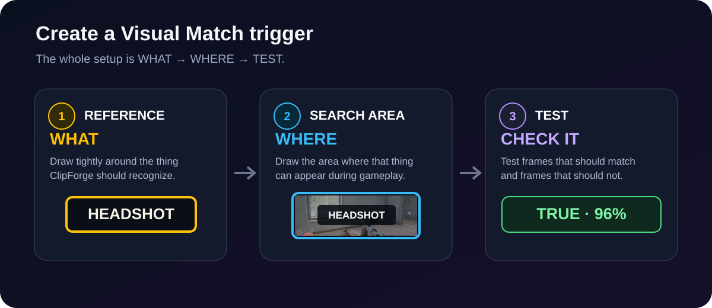
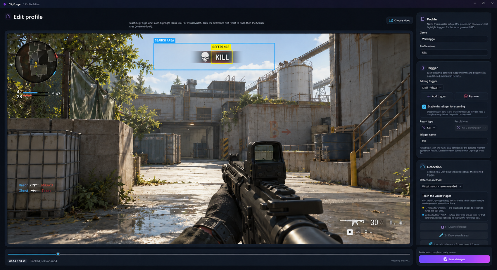
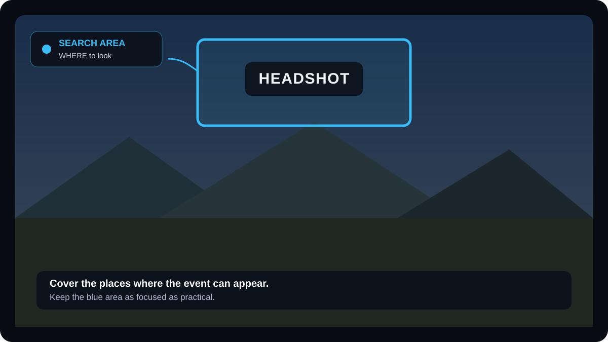
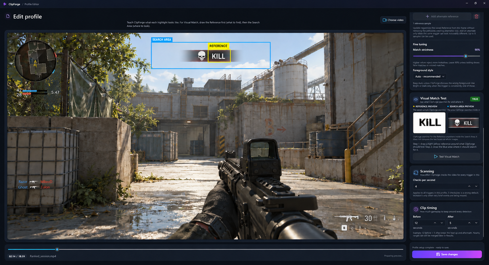

# Create your first ClipForge profile

Set up one trigger, test it on your recording, then scan for your first highlights. No image-recognition knowledge is needed.

## TL;DR — your first highlights

1. Open **Profiles → New profile**, choose a video and name your profile and trigger.
2. Select **Visual Match** and pause on the event.
3. Draw the **yellow Reference** tightly around the word or icon, then the **blue Search Area** where it can appear.
4. Click **Test Visual Match** on frames with and without the event. Start with **90% Match strictness** and **Auto** foreground.
5. **Save profile**, select it in **Library → Scanning Profile**, then **Start scanning**.
6. Review **Results**, keep your clips and **Export included clips**.

**Yellow = WHAT. Blue = WHERE. Test → Save → Scan.**

---

[Visual Match](#visual-match-setup) · [OCR](#ocr-profiles) · [Start scanning](#start-scanning) · [Common problems](#common-problems)

The most important idea is:

> **Reference = WHAT ClipForge should recognize.**  
> **Search Area = WHERE ClipForge should look for it.**

## Before you start

Use a recording where the event you want to detect is clearly visible at least once.

Good first triggers include:

- HEADSHOT
- KILL
- VICTORY
- a medal or kill icon
- an objective notification
- another HUD element that appears consistently

Start with one trigger and make sure it works before adding more.

---

## 1. Create the profile

1. Open **Profiles** and choose **New profile**.
2. Click **Choose video** and select a recording from the game. If you already selected a recording in Library, it may be loaded automatically.
3. Enter the **Game** and **Profile name**.
4. Give the first trigger a clear name, for example **Headshot**. One trigger is already created for you; use **Add trigger** only when you want another.

One profile can contain several independent triggers for the same game or HUD.

The video is on the left and settings are in a scrollable sidebar on the right. **Choose video** is above the preview. When you open a saved profile without a recording, the preview is black and test controls stay disabled until you choose a video.

**Result type**, **Result icon** and **Trigger name** label the moments in Results. **Detection method** controls what ClipForge actually looks for.

---

## 2. Choose the Detection method

### Visual Match setup

Use **Visual Match** when the thing you want to find has a recognizable appearance:

- HUD icons
- medals
- logos
- fixed words such as HEADSHOT
- notification graphics

This is usually the best place to start.

### OCR

Use **OCR** when the important part is the actual text and the surrounding graphics may change.

Examples:

- player or objective text
- several different words in the same HUD location
- notifications containing extra numbers or names

The Visual Match setup is explained first below. Jump to **OCR profiles** further down if that is what you need.

---

## Visual Match setup

### 3. Find a clean frame

Use the timeline below the video to find a frame where the target is clearly visible.

Try to avoid:

- motion blur
- fades or animations halfway through
- explosions or particles covering the target
- a mouse cursor sitting on top of it

You can scrub to another frame at any time.

---

### 4. Draw the Reference — WHAT

Click **1 · Draw reference**, then draw the yellow box tightly around the thing ClipForge should recognize.

### Good Reference

- tightly surrounds the target
- contains as little unrelated background as practical
- captures the part that stays visually consistent

### Avoid

- drawing around half the screen
- including lots of moving gameplay behind the target
- including nearby UI that changes constantly

After you draw the Reference, ClipForge captures the first visual sample automatically.

The **Reference Preview** shows what ClipForge is trying to recognize.

> The Reference does **not** have to be inside the Search Area on the frame where you create it. They are independent: Reference describes **what**, Search Area describes **where**.

---

### 5. Draw the Search Area — WHERE

Click **2 · Draw search area**, then draw the blue box around the part of the screen where this event normally appears.

The Search Area can be larger than the Reference because ClipForge searches **inside** it for the Reference.

### Good Search Area

- covers every normal position where the event can appear
- stays as small as practical
- avoids unrelated HUD areas when possible

### Example

If HEADSHOT always appears near the upper-middle part of the screen:

- Reference = a tight yellow box around the word HEADSHOT
- Search Area = a larger blue box covering the notification area where HEADSHOT can appear

ClipForge is **not** comparing the whole yellow box against the whole blue box. It searches for the Reference anywhere inside the Search Area.

---

### 6. Test the current frame

Click **Test Visual Match**.

You will see:

- **Reference Preview** — what ClipForge searches for
- **Search Area Preview** — what the current Search Area sees
- **TRUE / FALSE** — whether the current frame matched
- **Similarity** — how closely the best match resembles the Reference
- **Threshold / Match strictness** — the minimum similarity required for TRUE

### Start with the default Match strictness

The default **90%** is a strong starting point.

Only change it after testing:

- getting false matches → raise the threshold
- clearly correct events are missed → lower it a little

Do not tune the threshold before the Reference and Search Area are good.

Leave **Foreground style** on **Auto · recommended**. Use Bright or Dark only if Auto selects the wrong foreground and the target consistently uses that style.

Scroll down the sidebar to find **Visual Match Test**, **Scanning** and **Clip timing**. The saved Reference Preview is still visible without a video; the Search Area Preview is populated when you test a loaded frame.

---

### 7. Test more than one frame

Do not test only the exact frame used to create the Reference.

Scrub through the recording and test:

1. a frame where the event **should** match
2. another frame where it should still match
3. a nearby frame where it **should not** match

That quickly catches a Reference that is too broad or a threshold that is too loose.

---

### 8. Alternate references

Use **Add alternate reference** only when the **same trigger** can genuinely look different.

Examples:

- the same icon has two colors
- the same notification has a noticeably different animation state
- different HUD themes produce different appearances

You can use up to **8 visual samples total** for one trigger.

Do not add alternates just because the gameplay background changed. The Reference should already be focused on the HUD element itself.

**Update reference from current frame** keeps the same yellow Reference geometry and recaptures it from the frame you are currently viewing. Existing alternate references are kept.

Drawing or moving the yellow Reference captures a new main sample and removes existing alternates. Finish the Reference geometry before adding alternates.

---

## OCR profiles

Select **OCR** as the detector type when ClipForge should read text rather than match one exact visual appearance. OCR uses the blue Search Area and a text rule; no yellow visual Reference is needed.

### 1. Draw the Search Area

Draw the area where the text appears. Keep it focused on the relevant HUD text.

### 2. Test OCR before writing a rule

You can press **Test text on current frame** even before entering a text rule.

ClipForge will show what OCR read from that frame. This is useful for checking whether the Search Area is good before deciding on the rule.

### 3. Choose a text rule

- **Contains · recommended** — best for text that may include extra words or numbers
- **Exact text** — the entire OCR result must match
- **Regex · advanced** — flexible pattern matching

You can add alternative targets on separate lines.

For example, one line can contain KILL and the next can contain HEADSHOT.

Test several frames before saving.

---

## Multiple triggers in one profile

A profile can contain several independent triggers, for example:

- Kill
- Headshot
- Objective captured
- Victory

Select a trigger from the trigger list to edit its detector.

Disabling **Enable this trigger for scanning** keeps that trigger in the profile for later. A disabled trigger still needs a complete setup before the profile can be saved. Keep at least one trigger enabled.

If a trigger is not wanted at all, remove it instead of leaving an unfinished trigger in the profile.

---

## Scanning and clip timing

### Checks per second

This setting applies to every trigger in the profile.

**5 checks/sec** is a strong default. Increase it only if very brief events are being missed.

Higher values mean more frames are checked and therefore more work during a scan.

### Before / After

These values decide how much gameplay is kept around a detected event.

Example:

- **Before: 12 seconds**
- **After: 5 seconds**

This keeps the lead-up to the moment as well as the immediate aftermath.

---

## Before you save

For every trigger, check that:

- the trigger has a clear name
- the correct detector type is selected
- Visual Match has a Reference
- the Search Area is defined
- test frames behave as expected
- clip timing makes sense for the event

Then click **Save profile**. When editing an existing profile, the button is **Save changes**.

If Save is disabled, the message above the button tells you what is still incomplete.

---

## Start scanning

1. Return to **Library** and add the recordings you want to scan.
2. Select your saved profile under **Scanning Profile**.
3. Click **Start scanning**.
4. Open **Results**, inspect the detected moments and keep or skip the proposed clips.
5. Adjust clip ranges if needed, then use **Export included clips**.

Start with a short recording containing a known event. If the result is wrong, edit the profile, test the event frame again and scan again.

Keep the game language, HUD layout and HUD scale consistent with the recordings used to create the profile. After changing them, test the profile again and recapture references or search areas where needed.

## Common problems

| Problem | Try this |
|---|---|
| Correct event shows FALSE | Test a cleaner frame, tighten the Reference, then lower the threshold slightly only if needed. |
| Random gameplay shows TRUE | Tighten the Reference, reduce the Search Area, or raise the threshold. |
| Match works only on the exact Reference frame | Capture a cleaner Reference or add a genuine alternate appearance. |
| ClipForge finds the right graphic in the wrong place | Make the Search Area smaller. |
| OCR reads lots of unrelated text | Make the OCR Search Area tighter. |
| OCR reads the text but result is FALSE | Check the text rule and use **Contains** unless Exact is really needed. |
| Tests match but a brief event is missed during scanning | Increase Checks per second slightly and scan the short sample again. |
| Matches stopped after changing HUD settings | Test with the new layout, scale or language; update the Reference and Search Area as needed. |
| Save is disabled | Read the completion message above **Save profile**; every stored trigger must be complete. |

